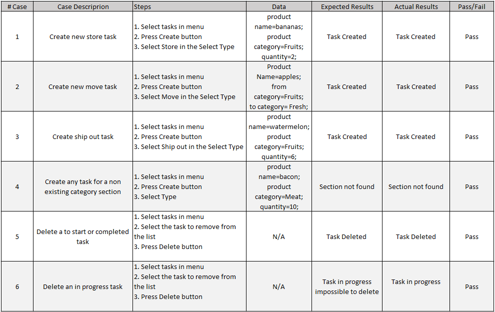

User Story 1  
  
  

[User Story 2]  
  
  

[User Story 3]  
  
  

[User Story 4]  
  
  

[User Story 5]  
  
  

[User Story 6]  
  
  

[User Story 7]  
  
  

[User Story 8]  
  
  

[User Story 9]  
  
  

[User Story 10]  
  
  

[User Story 11]  
  
  

[User Story 12]  
  
  

[User Story 15]  
  
  

[User Story 16]  
  
  

[User Story 17]  
 
  

[User Story 18]  
  
  

[User Story 19]  
  
  

